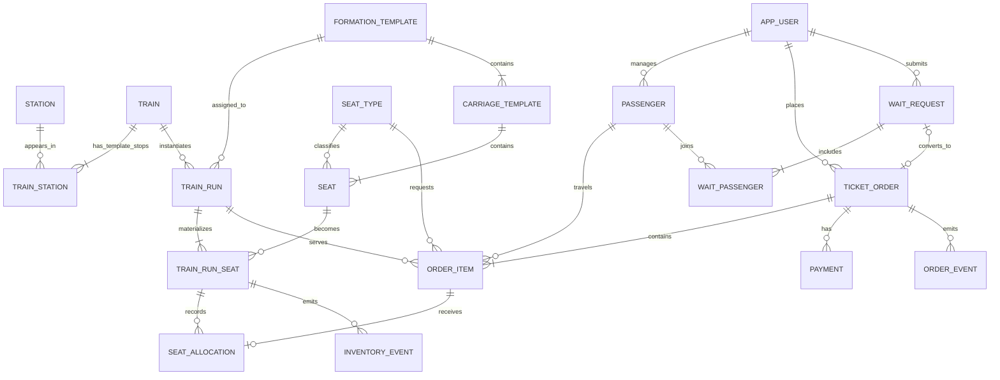

# 长三角 12306 客票综合销售系统：售票域概念设计草案

> 状态：设计评审稿 v0.1  
> 范围：长三角地区、一个模拟开行日、单次列车内直达售票  
> 本文只定义业务边界、实体关系、数据库不变量和并发事务边界，不包含可执行 DDL。

## 1. 设计目标

系统的核心不是普通订单 CRUD，而是在列车多区间运行条件下正确管理可复用席位：

- 一张 A 到 D 的票占用 A-B、B-C、C-D 三个相邻运行区间；
- 同一席位可分别出售 A-B 和 B-D，但不能出售两个有重叠区间的行程；
- 付款前短时占座与已付款车票都消耗库存；
- 取消、退款或支付超时必须准确释放原区间；
- 任意并发时序下不得超卖；
- 候补兑现必须可重复执行、可审计且具有明确公平规则；
- MySQL 是订单和库存的唯一事实来源，Neo4j 只保存可重建的铁路网络投影。

## 2. 第一阶段业务边界

### 2.1 纳入范围

- 一个模拟开行日，但允许列车跨午夜到达；
- 同一列车运行实例内的直达购票；
- 系统自动分配全程不换座的席位；
- 单人和多人订单，多人订单席位分配全成功或全失败；
- 固定票价或预生成的 OD 票价；
- 付款前短时占座、支付成功、主动取消、支付超时和退款；
- 无票后的候补申请与库存释放后的自动兑现；
- 并发购票、幂等、死锁重试、审计和库存对账；
- MySQL 查询与 Neo4j 路径查询的对比实验。

### 2.2 暂不纳入范围

- 全国路网和多日期长期售票；
- 真实支付平台、实名核验和动态二维码；
- 无座票、超售、儿童票、学生票及复杂优惠；
- 分票、部分退款和部分候补兑现；
- 跨车次联程票的一体化库存事务；
- 动态调价和收益管理优化；
- Redis、消息队列、微服务和数据库分片。

换乘查询可以在第一阶段后半部分实现，但每段车票仍是独立库存产品，不做跨列车原子占座。

## 3. 核心术语

| 术语 | 定义 |
|---|---|
| 车次模板 `train` | 公共车次代码及其静态属性，例如 G7592 |
| 运行实例 `train_run` | 某个模拟开行日实际执行的一趟列车 |
| 停站序号 | 从 1 开始的列车停站顺序 |
| 相邻区间 | 停站序号 `k` 到 `k+1` 的运行区间 |
| 售票区间 | 上车序号 `from_order` 到下车序号 `to_order`，左闭右开 |
| 席位单元 | 可在不同非重叠区间重复销售的最小容量单位 |
| 区间掩码 | 售票区间覆盖的所有相邻区间对应的 bit 集合 |
| HOLD | 已占用库存、尚未支付且存在过期时间的临时分配 |
| CONFIRMED | 已支付并确认的席位分配 |
| RELEASED | 已取消、超时或退款，不再占用库存的分配 |

## 4. 总体实体关系



## 5. 表职责草案

### 5.1 静态铁路数据

#### `station`

保留现表，后续补充稳定的业务站码，而不能只依赖中文名称。

关键约束：

- `station_id` 主键；
- `station_code` 唯一且非空；
- 站名可以重复，不能作为业务主键。

#### `train`

保留现表，表示车次模板，而不是某日可售列车。

建议属性：

- `train_no`；
- `train_type`；
- `default_formation_id`；
- `active`；
- 数据来源和版本。

#### `train_station`

保留为静态停站模板，增加：

- `arrival_day_offset`；
- `departure_day_offset`；
- 可选的营业办理标记；
- 可选的里程或累计里程。

时间必须沿停站序号单调递增。始发站允许到达时间为空，终到站允许出发时间为空。

#### `train_segment`

保留为 `train_station` 的受控派生表，用于相邻区间查询和 Neo4j 导入。

必须满足：

- `to_order = from_order + 1`；
- `from_station_id <> to_station_id`；
- 同一车次和起止序号唯一；
- 不允许独立于 `train_station` 手工维护。

### 5.2 当日运行与编组

#### `train_run`

一条记录表示一个具体开行实例。

建议字段：

- `run_id`：代理主键；
- `train_no`：模板外键；
- `service_date`：裁剪后长三角区域运行片段起点的服务日；
- `formation_id`：本次使用的编组；
- `run_status`：`PLANNED/ON_SALE/STOP_SALE/CANCELLED/FINISHED`；
- `sale_start_at`、`sale_end_at`；
- `version`：乐观并发和变更检测；
- 创建、更新时间。

唯一约束初稿：`(train_no, service_date)`。如果以后同日允许同车次多次开行，应改成包含运行序号的复合唯一键。

#### `formation_template`

描述一套合成编组。第一阶段不宣称还原真实铁路编组，只提供可重复的实验容量。

#### `carriage_template`

描述编组中的车厢顺序、席别和容量。

#### `seat_type`

例如商务座、一等座、二等座、软卧、硬卧、软座、硬座。第一版可缩减为 2 到 4 类。

#### `seat`

具体席位单元，包含车厢号、席位号、席别和可选的座位属性。即使界面不允许选座，内部仍必须区分席位单元。

座席位置使用 `A/B/C/D/F` 字母，其中没有 E。购票时可指定一个位置字母：有全程可用席位时优先满足；无该位置时可由用户选择严格失败，或允许系统按余票状态兜底分配。

#### `train_run_seat`

运行实例上的席位当前状态，是位图库存的核心表。

建议字段：

- `run_id`；
- `seat_id`；
- `occupied_mask BIGINT UNSIGNED`，初始为 0；
- `version`；
- `updated_at`。

主键：`(run_id, seat_id)`。

只有 `HOLD` 和 `CONFIRMED` 分配对应的区间 bit 可以为 1。

### 5.3 票价与销售产品

#### `run_fare`

建议直接生成运行实例的 OD 席别票价：

- `run_id`；
- `from_order`；
- `to_order`；
- `seat_type_id`；
- `amount`；
- `currency`；
- `sale_status`。

唯一约束：`(run_id, from_order, to_order, seat_type_id)`。

订单必须保存票价快照，历史订单不能随着当前票价变化。

### 5.4 用户、乘车人与订单

#### `app_user`

购票账户。课程项目只保存必要字段，密码必须保存安全散列，不能保存明文。

#### `passenger`

乘车人。为避免保存真实敏感身份信息，可以使用模拟证件号或不可逆散列。

#### `ticket_order`

订单头，建议字段：

- `order_id`；
- `order_no`；
- `user_id`；
- `order_status`；
- `total_amount`；
- `expires_at`；
- `idempotency_key`；
- `source`；
- `version`；
- 时间戳。

`(user_id, idempotency_key)` 必须唯一，防止重复点击和网络重试产生重复订单。

#### `order_item`

一名乘车人的一张票：

- `order_id`；
- `passenger_id`；
- `run_id`；
- `from_order`、`to_order`；
- `seat_type_id`；
- `price_snapshot`；
- `item_status`。

第一阶段一张票全程只能对应一个席位。

#### `seat_allocation`

席位分配事实记录：

- `allocation_id`；
- `order_item_id`；
- `run_id`、`seat_id`；
- `from_order`、`to_order`；
- `segment_mask`；
- `allocation_status`：`HOLD/CONFIRMED/RELEASED`；
- `held_until`；
- 分配和释放时间；
- `release_reason`。

同时保存请求位置、实际分配位置和分配策略快照，以区分 `PREFERRED`、`FALLBACK_INVENTORY` 和 `AUTO_INVENTORY`。

`order_item_id` 在第一阶段最多有一个未释放分配。历史释放记录不应物理删除。

#### `payment`

保存支付尝试与回调结果。支付请求号和模拟渠道流水号必须唯一，重复回调只能产生一次状态变化。

### 5.5 候补与审计

#### `wait_request`

候补请求头：

- 用户、运行实例、起止序号和席别；
- 请求人数；
- 状态；
- `created_at`；
- `skip_count`；
- 可计算的老化优先级；
- 成功转换出的订单 ID；
- `version`。

#### `wait_passenger`

候补请求中的乘车人列表。第一阶段仅支持整单兑现。

#### `order_event`

只追加的订单状态变更日志，保存旧状态、新状态、原因、操作者和关联请求号。

#### `inventory_event`

只追加的库存变化日志，保存运行实例、席位、掩码、变更类型、订单项和事务追踪号。

审计事件不应作为当前状态表使用；当前状态仍由订单、分配和席位位图表示。

## 6. 位图定义

对于有 `n` 个停站的列车，共有 `n-1` 个可售相邻区间。停站序号从 1 开始时，第 `k` 个相邻区间对应 bit `k-1`。

售票区间 `[from_order, to_order)` 的掩码为：

```text
request_mask = ((1 << (to_order - from_order)) - 1) << (from_order - 1)
```

当前数据最大只有 11 个相邻区间，使用 `BIGINT UNSIGNED` 足够。仍应校验：

- `1 <= from_order < to_order <= stop_count`；
- 掩码不得包含运行实例不存在的高位；
- 保存的 `segment_mask` 必须等于根据起止序号重新计算的结果。

席位可售条件：

```text
(occupied_mask & request_mask) = 0
```

占用：

```text
occupied_mask = occupied_mask | request_mask
```

释放：

```text
occupied_mask = occupied_mask & ~request_mask
```

释放前必须锁定席位行并验证对应分配当前仍为有效状态，避免重复取消错误地清除库存。

## 7. 数据库不变量

以下约束比接口功能更重要，应成为自动化测试和对账查询的核心。

1. 同一 `train_run_seat` 的两个有效分配，其 `segment_mask` 按位与必须为 0。
2. `train_run_seat.occupied_mask` 必须等于该席位所有 `HOLD` 与 `CONFIRMED` 分配掩码的按位或。
3. `RELEASED` 分配的掩码不得出现在当前位图中，除非相同 bit 被另一条合法有效分配占用；按照不重叠规则，正常情况下不会出现后者。
4. `PENDING_PAYMENT` 订单必须具有未过期的 HOLD；`PAID` 订单必须具有 CONFIRMED 分配。
5. `CANCELLED`、`TIMEOUT`、`REFUNDED` 订单不得继续占用库存。
6. 一笔多人订单的所有订单项必须一起占座成功，否则整个事务回滚。
7. 同一幂等键只能对应一笔订单。
8. 同一支付渠道流水只能成功确认一次。
9. 已取消或停止销售的运行实例不能创建新 HOLD。
10. 候补请求最多成功转换为一笔订单。
11. 订单金额等于订单项价格快照之和。
12. 同一乘车人不能持有时间重叠的有效行程；该规则需要事务查询与锁配合，不能只依赖普通唯一键。
13. 所有订单和库存状态变化都必须产生审计事件。

## 8. 状态机

### 8.1 订单状态

```text
CREATING
   └─占座成功──> PENDING_PAYMENT
                     ├─支付成功──> PAID
                     ├─用户取消──> CANCELLED
                     └─支付超时──> TIMEOUT

PAID
   └─申请退票──> REFUNDING
                    ├─退款成功──> REFUNDED
                    └─退款失败──> PAID
```

`CREATING` 可以只存在于事务内部。付款不在持锁事务内执行。

### 8.2 席位分配状态

```text
HOLD ──支付成功──> CONFIRMED
  │                    │
  ├─取消/超时──────────┤
  │                    └─退款成功
  └──────────────────────────────> RELEASED
```

### 8.3 候补状态

```text
WAITING
   ├─取消──> CANCELLED
   ├─截止──> EXPIRED
   └─匹配成功──> MATCHED_HOLD
                    ├─支付成功──> FULFILLED
                    └─支付超时──> WAITING 或 EXPIRED
```

候补占座超时后是否回到队列，应作为明确业务参数；初稿建议在候补截止时间之前回到队列，但保留原始申请时间并增加一次失败计数。

## 9. 关键事务边界

### 9.1 创建支付占座

单个短事务完成：

1. 校验幂等键、运行状态、票价和乘车人冲突；
2. 计算请求掩码；
3. 查询满足位图条件的席位；
4. 按席位主键升序使用 `FOR UPDATE` 锁定席位；
5. 再次验证位图不冲突；
6. 创建订单、订单项和 HOLD 分配；
7. 更新席位位图；
8. 写订单和库存审计事件；
9. 提交。

多人订单必须在同一事务内找到全部席位。无法满足时不得留下部分分配。

### 9.2 支付确认

1. 通过支付幂等键锁定支付与订单；
2. 验证订单仍为 `PENDING_PAYMENT` 且 HOLD 未被释放；
3. 更新订单为 `PAID`，分配为 `CONFIRMED`；
4. 位图不变；
5. 写审计事件并提交。

### 9.3 取消、超时与退款释放

1. 锁定订单、分配和对应席位行；
2. 验证当前状态允许转换；
3. 清除该分配对应的位图；
4. 将分配标记为 `RELEASED`；
5. 更新订单状态；
6. 写库存释放事件；
7. 提交；
8. 提交后唤醒或等待后台候补匹配任务。

### 9.4 候补兑现

候补工作线程使用 `FOR UPDATE SKIP LOCKED` 领取队列项，但 `SKIP LOCKED` 仅用于队列领取，不能用来获得面向用户的精确库存视图。

初始排序规则：

1. 同运行实例、同席别；
2. 能够完整满足全部乘车人；
3. 申请时间优先；
4. 使用 `skip_count` 或等待时长进行老化；
5. 相同优先级按 `wait_id` 确定性排序。

所有跳过和兑现都要记录原因，以便评价公平性和队首阻塞。

## 10. 隔离级别与死锁策略

当前 MySQL 默认是 `REPEATABLE READ`。项目应对比：

- `REPEATABLE READ`；
- `READ COMMITTED` 加显式 `FOR UPDATE`；
- 可选的 `SERIALIZABLE` 对照组。

推荐业务实现优先采用 `READ COMMITTED` 加明确行锁和条件更新，原因是库存不变量由锁、状态条件和事务共同保证，不需要依赖大范围 next-key lock。

统一规则：

- 席位按 `(run_id, seat_id)` 升序加锁；
- 订单先锁订单头，再锁订单项和席位；
- 事务内禁止网络调用；
- 死锁或锁等待超时进行有限次数、带随机退避的整事务重试；
- 每次重试使用相同幂等键；
- 使用 Performance Schema 记录锁等待和死锁证据。

## 11. Neo4j 边界

### 11.1 应承担的职责

- 路网可达性；
- 站点间候选拓扑路径；
- 枢纽、度中心性和网络可视化；
- 限制换乘次数后的候选车站序列；
- 与 MySQL 递归查询或多表查询的实验比较。

### 11.2 不应承担的职责

- 当前余票；
- 席位占用；
- 订单与支付；
- 候补当前状态；
- 防超卖事务。

### 11.3 投影改造

- MySQL 到 Neo4j 单向同步；
- `Station.station_id` 保持唯一；
- `TRAIN_SEGMENT.segment_id` 增加关系属性唯一约束；
- 导入使用 `MERGE`，或者采用明确的全量删除后重建流程；
- 增加聚合 `RAIL_LINK`，避免数千条车次边造成普通拓扑路径爆炸；
- 导入记录源数据版本、导入时间和校验数量；
- Neo4j 中的时间使用原生时间类型或明确的分钟数，不保存含义不明的字符串。

## 12. 现有数据迁移计划

1. 导出当前四表 DDL、行数和校验摘要，不直接覆盖原始表。
2. 对每个车次按 `station_order` 排序，从始发时间开始推导 day offset。
3. 时间发生合理的午夜回绕时增加 day offset；异常的大幅逆序记录进入人工检查清单。
4. 验证完整到发时间单调性、相邻站序、重复停站和空值规则。
5. 为选定模拟服务日生成 `train_run`。
6. 按 `train_type` 分配合成编组模板，并生成 `train_run_seat`，初始位图全部为 0。
7. 生成所有有效 OD 与席别的 `run_fare`。
8. 用改造后的幂等脚本重建 Neo4j 投影。
9. 在任何售票测试前运行空库存对账，确认所有位图为 0、无有效分配。

## 13. 建议的合成编组策略

在没有真实编组数据时，不应伪装成真实席位数据。建议明确标注为实验模板，例如：

| 车次类型 | 第一版席别 | 容量策略 |
|---|---|---|
| G/C | 商务、一等、二等 | 小型合成动车组模板 |
| D | 一等、二等 | 合成动车组模板 |
| Z/T/K/其他 | 软卧、硬卧、硬座 | 合成普速模板 |

第一轮并发实验可以进一步缩小容量，例如每车次每席别 20 到 100 个席位，以便稳定复现实验并清楚展示库存耗尽和候补兑现。

## 14. 对照实验计划

### 14.1 库存表示

比较：

- 位图：每个运行实例席位一行；
- 关系行：每个被占用的相邻区间一行，主键为 `(run_id, seat_id, segment_order)`。

指标：

- 存储空间；
- 单区间和长区间余票查询延迟；
- 购票与取消吞吐；
- 锁等待和死锁次数；
- 数据可解释性；
- 对账复杂度。

### 14.2 隔离级别

在相同工作负载下比较 `READ COMMITTED`、`REPEATABLE READ` 和可选 `SERIALIZABLE`。

### 14.3 索引

对关键查询保存：

- SQL；
- `EXPLAIN ANALYZE`；
- 实际扫描行数；
- 建索引前后延迟；
- 并发下锁等待差异。

### 14.4 正确性压力测试

- 多线程抢最后一个席位；
- 两个互不重叠区间复用同一席位；
- 两个重叠区间竞争同一席位；
- 多人订单只剩部分容量；
- 支付和超时任务同时处理同一订单；
- 用户取消和支付回调同时发生；
- 重复支付回调和重复取消；
- 候补多工作线程同时领取；
- 任意步骤异常后的事务回滚与对账。

验收条件不是“接口返回成功”，而是所有不变量在压力测试后仍成立。

## 15. 下一设计步骤

本草案确认后，下一份交付物应是字段级逻辑模型和 DDL 评审稿，顺序如下：

1. 确定模拟服务日和编组容量参数；
2. 明确保留原表还是通过新表迁移；
3. 为每张表确定字段类型、主外键、唯一约束和检查约束；
4. 定义受控存储过程的输入输出和错误码；
5. 编写迁移 DDL，但仍不执行；
6. 评审通过后再对 Docker 中的 `CR12306` 执行版本化迁移。
