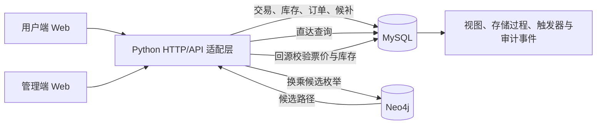
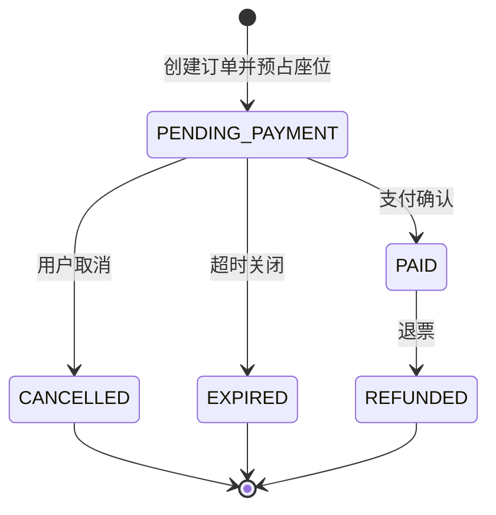

# CR12306 当前系统设计、数据库关键技术与未来优化方案

> 文档定位：当前阶段技术总结，可用于课程报告、项目答辩与后续协作开发。  
> 基准版本：数据库迁移 V002—V014，Web 用户端与管理端当前实现。  
> 演示运行日：2026-09-07（当前系统将购票日期固定为演示日期）。

## 摘要

CR12306 是一个围绕“铁路客票库存一致性”构建的数据库课程项目。系统完整覆盖车次查询、区间库存判断、座位分配、订单预占、支付、取消与退票、候补兑现、管理监控以及 AI 负载模拟等关键流程。

系统采用 MySQL 与 Neo4j 协同的混合架构：MySQL 是订单、票价、库存和候补队列的唯一事实来源，负责所有强一致写入；Neo4j 只负责复杂路径和换乘候选的快速枚举，候选结果返回后仍由 MySQL 校验并完成最终扣票。这样的职责划分兼顾了关系数据库的事务一致性与图数据库的路径表达能力，同时避免出现多个数据库共同决定库存而造成的双写不一致。

当前系统最核心的设计是“区间位图库存”。一张物理座位不是简单的“有票/无票”，而是用一个 64 位整数记录它在各相邻站间区段上的占用状态。系统通过位运算判断某一乘车区间是否与已有订单重叠，因此同一座位可以在互不重叠的区间上被不同乘客复用。这一模型配合事务、行级锁、幂等键、状态机和审计事件，实现了较完整的高并发订票逻辑。

---

## 1. 当前系统设计

### 1.1 总体架构



系统由四个主要部分组成：

1. **用户端**：完成登录/注册、城市与车站选择、车次查询、途经站展开、席别与座位偏好选择、下单、支付、订单查看和退票。
2. **管理端**：查看运行概况、车次与席位库存、乘客与订单、候补队列、审计状态，并运行 AI 订票和退票任务。
3. **应用适配层**：使用 Python `ThreadingHTTPServer` 提供本地 API，将前端请求转换为数据库查询或存储过程调用。
4. **数据层**：MySQL 保存权威业务数据；Neo4j 保存可重建的查询图投影，用于复杂路径搜索。

### 1.2 用户端与管理端隔离

用户端和管理端使用不同的页面入口、导航结构和接口集合：

- 用户端只暴露普通乘客需要的查询、订票与本人订单操作，避免显示数据库内部字段和运营数据。
- 管理端集中展示库存位图、队列、公平保护、订单和 AI 压测数据，用于观察系统内部状态。
- 当前隔离主要体现在页面与接口用途上；生产级身份认证、管理员权限控制仍属于后续优化项。

### 1.3 用户购票流程

当前用户流程分为四个阶段：

1. **登录/注册**：用户输入姓名和密码。首次使用时创建账户，之后浏览器通过 `localStorage` 记住账户信息。
2. **选择行程**：选择出发城市/车站和到达城市/车站。用户只选择城市时，系统会将其展开为该城市下的全部车站，例如“上海”可覆盖上海站、上海虹桥等。
3. **查询车次**：结果按实际出发时间排序，同一车次的不同席别折叠到同一车次卡片中，并分别显示票价和余票。点击“途经”可展开停站时刻。
4. **确认订单**：选择席别、乘车人和座位位置偏好，提交后系统直接完成库存锁定与支付确认，并展示实际分配的车厢和座位。

车站标识依据车站在整趟列车运行序列中的位置计算：

- 当前站是整趟列车第一个站时显示“始”；
- 当前站是整趟列车最后一个站时显示“终”；
- 列车仅经过该站时显示“过”。

因此，一趟“南通始发—途经上海—南京终到”的列车，在查询上海到南京时，上海显示“过”，南京显示“终”，而不会因为上海是本次查询的出发点就错误显示“始”。

### 1.4 车次、运行实例与席位建模

系统区分“列车模板”和“某日运行实例”：

- `train` / `train_station` 描述车次编号和固定停站顺序；
- `train_run` 表示指定服务日期上的一次实际运行；
- `formation_template`、`carriage_template`、`seat_type` 和 `seat` 描述编组、车厢、席别和物理座位；
- `train_run_seat` 将物理座位实例化到具体运行日，并保存其区间占用位图；
- `run_fare` 保存某运行实例、起讫区间和席别对应的可售产品及票价。

这种分层避免了每天重复保存完整静态时刻表，同时允许不同日期使用不同编组、票价和库存。

### 1.5 城市/车站查询与直达、换乘职责

查询首先将城市级条件展开为候选车站集合，再保证出发站在到达站之前，从而过滤无效方向。

- **直达查询**由 MySQL 完成，因为列车停站、销售区间、票价和余票都属于关系型数据，适合通过索引和联接查询。
- **换乘查询**由 Neo4j 枚举可能的两段路径，擅长表达“车站—车次—车站”的图关系。
- Neo4j 返回的仅是候选方案。应用层把候选重新提交给 MySQL，由 MySQL 校验运行日期、时间衔接、票价和实时库存。

这一原则可以概括为：**图数据库负责找路，关系数据库负责判定能否出售。**

### 1.6 区间位图库存

假设一趟列车依次经过 `n` 个站，则存在 `n-1` 个相邻运行区段。每个座位使用 `BIGINT UNSIGNED occupied_mask` 保存这些区段是否已占用，每一位对应一个相邻区段。

对站序区间 `[from_order, to_order)`，请求位图为：

```text
request_mask = ((1 << (to_order - from_order)) - 1) << (from_order - 1)
```

核心运算为：

```text
可售判断：occupied_mask & request_mask = 0
占用区间：occupied_mask = occupied_mask | request_mask
释放区间：occupied_mask = occupied_mask & ~request_mask
```

例如 A—B—C—D 有三个区段。一名乘客购买 A→C 时占用前两位；另一名乘客不能再购买 B→D 的同一座位，因为 B→C 重叠，但仍可购买 C→D。这样既防止超卖，又允许同一座位在前后不重叠区间复用。

当前使用 64 位整数，因此一趟列车最多支持 63 个相邻区段。现有数据满足这一限制；若未来需要支持更长线路，可迁移为多字位图、`VARBINARY` 位集或分段库存表。

### 1.7 创建订单与座位分配

核心存储过程 `sp_create_order_hold` 在单个事务中完成以下操作：

1. 校验用户、乘车人、车次运行实例、起讫站序、席别和票价产品；
2. 根据起讫站序计算 `request_mask`；
3. 检查幂等键，防止网络重试生成重复订单；
4. 检查乘客在时间上是否已有冲突行程；
5. 按固定顺序使用 `SELECT ... FOR UPDATE` 锁定候选座位行；
6. 在锁内重新判断位图是否空闲；
7. 为全部乘客分配座位、写入订单明细与分配记录，并用按位或更新库存；
8. 写入订单和库存审计事件；
9. 全部成功后提交；任何乘客无法分配时整体回滚。

多人同行订单采用“全有或全无”策略，避免同一订单只为部分乘客成功扣票。

### 1.8 座位偏好与自动降级

二等座支持 A、B、C、D、F，一等座支持 A、C、D、F 等位置偏好。系统优先选择用户指定位置；如果指定位置已无可用座位，则在剩余库存中自动分配，并返回分配策略：

- `PREFERRED`：满足用户偏好；
- `FALLBACK_INVENTORY`：偏好不可满足，已从剩余库存自动分配；
- `AUTO_INVENTORY`：用户未选择偏好，由系统自动分配。

前端在收到 `FALLBACK_INVENTORY` 时显示“当前剩余席位已无法满足偏好要求，已在剩余席位中为你分配”，但不要求用户二次确认，从而保持下单流程连续。

### 1.9 订单生命周期



- 创建订单时，座位分配状态为 `HOLD`，库存位图已经占用；
- 支付成功后订单转为 `PAID`，分配转为 `CONFIRMED`，库存不再重复修改；
- 取消、超时或退票时，事务锁定订单、分配和座位行，清除准确的区间位，并将分配标记为 `RELEASED`；
- 每次关键状态变化写入追加式事件表，便于审计和故障追踪。

用户端的“提交并确认订单”接口依次完成预占和支付，因此在正常演示流程中用户会直接看到已支付订单。

### 1.10 票价生成

系统先依据时刻表运行时间和不同列车类型的估算速度，计算相邻站间参考距离，再累加得到任意起讫区间的里程。`fare_rule` 按列车类型与席别配置基础价、公里单价和最低票价，生成 `run_fare`。

当前价格可概括为：

```text
票价 = max(最低票价, 按 0.5 元粒度取整(基础价 + 里程 × 公里单价))
```

订单创建时会把实际售价快照保存到订单明细，后续即使票价规则变化，历史订单金额也不会改变。当前距离和票价属于课程项目估算数据，不代表铁路官方价格。

### 1.11 候补队列与公平兑现

只有直接购票无法满足时才创建候补请求。队列基础顺序为 `created_at, wait_request_id`，同时考虑库存碎片：当前部请求无法匹配时，小订单可暂时越过它以提高座位利用率；每次被越过会增加 `skip_count`，达到阈值后进入 `fairness_protected`，后续请求不再继续绕过，防止大订单长期饥饿。

多个候补工作线程通过 `FOR UPDATE SKIP LOCKED` 竞争队列任务：已被一个工作线程锁定的请求会被其他线程跳过，从而既避免重复处理，又减少工作线程互相阻塞。

候补状态主要包括：

```text
WAITING → MATCHING → MATCHED_HOLD → FULFILLED
                       └──────────→ CANCELLED / EXPIRED
```

候补兑现复用 `sp_create_order_hold`，而不是再实现一套扣票算法；幂等键采用 `WAIT-{wait_request_id}`。即使工作线程重试，也不会重复生成订单。`matching_started_at` 可用于识别和恢复异常中断的匹配任务。

### 1.12 管理端与 AI 订票员

管理端目前包括：

- 运营总览：订单、库存、候补等核心指标；
- 车次与库存：按车次、席别查看余量及座位占用情况；
- 订单与乘客：查询订单状态、乘客信息和实际座位；
- 候补队列：观察队列顺序、跳过次数、公平保护和兑现状态；
- AI 订票员：创建随机或定向的并发订票负载。

AI 订票支持两类模式：

1. **随机订票**：模拟指定数量和并发度的用户，随机选择车次、区间和席别，并按设定支付率完成支付或进入候补。
2. **定向压测**：指定运行车次和席别，集中消耗特定库存，用于制造余票紧张、售罄和候补场景。

管理员还可以查询到具体 AI 乘客的订单，对单个 AI 用户执行取消预占或退票，也可以按车次随机批量处理若干 AI 订单。退票仍调用统一的订单生命周期存储过程，因此库存释放和审计逻辑与真实用户一致。

---

## 2. 关键逻辑涉及的高级数据库知识及实现方式

| 数据库知识 | 当前实现方式 | 解决的问题 |
|---|---|---|
| 关系建模与规范化 | 将车次、停站、运行日、编组、座位、票价、订单、支付、退款和候补拆分为独立实体 | 降低数据冗余，明确生命周期和实体关系 |
| 代理键与业务唯一约束 | 使用数值主键连接实体，同时为订单号、幂等键、支付流水等建立唯一约束 | 兼顾联接效率与业务去重 |
| 外键与检查约束 | 对订单明细、运行实例、乘客、席别等建立引用约束和状态约束 | 防止孤立记录和非法状态进入数据库 |
| 位图与位运算 | `BIGINT UNSIGNED occupied_mask` 表示最多 63 个运行区段，使用 `&`、`\|`、`~` 判断、占用和释放 | 高效表达区间重叠，并支持座位分段复用 |
| ACID 事务 | 下单、支付、取消、超时、退款和候补兑现都在事务边界内完成 | 保证订单、座位和审计事件要么全部成功，要么全部回滚 |
| 悲观并发控制 | 候选座位和订单使用 `SELECT ... FOR UPDATE` 锁定，锁内再次检查条件 | 防止两个并发请求同时拿到最后一张票 |
| 确定性锁顺序 | 候选座位按照稳定顺序加锁 | 降低多个事务锁顺序不一致引发死锁的概率 |
| `SKIP LOCKED` | 候补工作线程领取任务时跳过其他线程已经锁定的请求 | 支持多个消费者并行处理队列且避免重复兑现 |
| 幂等设计 | 用户订单使用唯一幂等键，候补使用 `WAIT-{id}`，支付流水也有唯一业务号 | 允许网络超时或任务恢复后的安全重试 |
| 状态机约束 | 存储过程只允许从合法前置状态更新到下一状态 | 防止重复支付、已退款订单再次退款等非法转换 |
| 存储过程与函数 | 核心库存修改、订单生命周期和候补匹配封装在数据库中 | 让所有入口复用同一套强一致规则 |
| 触发器 | 用于补充跨表状态同步和乘客行程冲突保护 | 避免某个调用入口遗漏必要约束 |
| 视图与读模型 | `v_order_detail`、`v_wait_queue`、运行停站等视图聚合业务信息 | 隔离底层表结构，为 Web 和管理端提供稳定查询接口 |
| 窗口函数 | 候补队列使用 `ROW_NUMBER()` 等生成可观察的排队序号 | 在不修改原始数据的情况下表达动态队列位置 |
| 临时表与 `JSON_TABLE` | 将 Neo4j 候选路径结构化导入 MySQL，再统一验证 | 安全批量校验跨数据库返回的候选数据 |
| 复合索引与查询索引 | 针对运行日、车次、订单状态、过期时间、用户时间范围和候补状态建立索引 | 减少扫描范围，支持查询与后台任务 |
| 追加式事件日志 | 订单、库存和候补的关键动作以事件形式追加记录 | 提供审计、故障定位、对账和未来事件驱动扩展基础 |
| 对账视图 | 汇总座位位图、分配状态和订单状态之间的异常 | 发现“订单已释放但位图未清除”等数据漂移 |
| 多模型数据库 | MySQL 作为交易权威，Neo4j 作为可重建的查询投影 | 在一致性边界清晰的前提下利用不同数据库优势 |

### 2.1 为什么位图比“剩余票数”更适合本系统

仅保存“某车次还剩多少张票”无法判断具体区间是否可售。例如一个座位已经售出 A→B，但仍然可以售出 B→D；如果只保存总余票，就无法表达这种区间关系。

另一种做法是为每个座位、每个区段保存一行数据，但这会快速放大行数，并要求下单时锁定多行。位图把一个座位的所有区段压缩到一行：一次按位与完成冲突判断，一次更新完成全部区段占用，十分适合当前最多 63 个区段的课程数据集。

### 2.2 为什么必须在锁内重新判断库存

“先查询空闲座位，再更新”之间存在时间窗口：两个线程可能同时看到同一个空闲座位。如果不加锁，两者都可能认为自己购票成功。

当前流程先筛选候选，再用 `FOR UPDATE` 锁定目标座位，并在获得锁后重新执行位图冲突判断。第二个事务必须等第一个事务提交，之后会看到已更新的位图，从而选择其他座位或返回无票。这是防止超卖的关键。

### 2.3 隔离级别与锁的关系

当前 MySQL 默认使用 InnoDB 的 `REPEATABLE READ`。核心正确性并不只依赖隔离级别，而是通过明确的行锁、唯一约束和状态条件共同保证。后续可对 `READ COMMITTED + 显式行锁`、当前 `REPEATABLE READ` 和 `SERIALIZABLE` 进行实验，比较吞吐量、锁等待、死锁率和异常行为，从而形成更有说服力的数据库课程实验结论。

### 2.4 数据库内核逻辑与应用层的边界

库存扣减、释放、幂等和状态迁移属于任何入口都不能绕过的业务不变量，因此放在存储过程中。页面流程、参数组装、结果展示和任务进度属于交互逻辑，放在应用层。这样的边界使用户端、管理端和 AI 订票员能够复用同一套库存规则，避免三套代码产生不一致结果。

---

## 3. 当前系统的核心不变量

系统正确性可归纳为以下不变量：

1. 同一运行实例、同一物理座位的已确认或预占区间不能重叠。
2. 只有合法状态的订单才能支付、取消、超时或退款。
3. 任一库存占用都必须能够追溯到座位分配和订单明细。
4. 订单释放后，只有该订单对应的区间位被清除，其他乘客占用不受影响。
5. 同一个业务请求多次重试最多生成一个有效订单或支付记录。
6. 多人订单必须全部分配成功后才能提交。
7. Neo4j 的查询结果不能直接扣减库存，最终销售资格必须由 MySQL 判定。
8. 候补兑现必须复用普通购票的库存事务，不允许绕过库存锁。
9. 历史订单使用成交时票价快照，不随之后的规则变化而改变。
10. 所有关键状态修改都应留下可审计事件，并能通过对账查询发现不一致。

---

## 4. 当前阶段的边界与不足

为课程演示和快速验证，当前系统仍有以下边界：

- 服务日期固定，尚未实现多日期滚动售票和真实列车运行调整；
- 登录方案为演示级实现，浏览器保存账户信息，密码仅做 SHA-256 摘要，不具备生产级会话和密码安全；
- 用户端与管理端虽然页面隔离，但尚未实现严格的管理员角色鉴权；
- Python 适配层通过本地命令行客户端访问数据库，缺少持久连接池、正式 Web 框架和统一 ORM/DAO 层；
- AI 任务主要保存在应用进程内，服务重启后的任务恢复能力有限；
- 票价和里程来自估算规则，并非官方铁路数据；
- 当前位图上限为 63 个相邻区段；
- 前端和 API 更侧重演示完整业务，尚未进行大数据量分页、缓存和生产级限流；
- 订单预占与支付由接口连续编排，仍应补强异常支付失败时的补偿和恢复策略；
- Neo4j 投影目前以重建/同步为主，尚未形成实时增量变更链路。

---

## 5. 未来优化方案

### 5.1 第一阶段：安全性与工程可靠性

优先级最高，应先保证系统可安全协作和稳定演示。

1. 使用 Argon2 或 bcrypt 加盐存储密码，服务端签发安全会话；加入退出失效、会话过期和登录限流。
2. 增加 `USER`、`OPERATOR`、`ADMIN` 等角色和后端 RBAC 校验，真正隔离用户接口与管理接口。
3. 使用正式 Python Web 框架和 MySQL 驱动，加入连接池、参数化 SQL、统一异常处理和结构化日志。
4. 将数据库地址、密码等敏感配置移入环境变量，生产环境启用 HTTPS、CSRF 防护和安全响应头。
5. 建立数据库版本表和自动迁移流程，使不同同学能可靠升级到相同 schema 版本。
6. 将订单超时关闭、候补匹配和 AI 压测改为可持久化后台任务，支持进程重启后的恢复。
7. 明确定义“预占成功但支付失败”的补偿流程，保证预占最终会支付或自动释放。

### 5.2 第二阶段：查询和性能优化

1. 使用 `EXPLAIN ANALYZE`、慢查询日志和性能基准定位真实瓶颈，再调整复合索引和覆盖索引。
2. 为车次结果、订单和管理端大表加入服务端分页，前端使用虚拟列表，避免一次渲染全部记录。
3. 预计算稳定的城市—车站映射和常用运行时刻读模型，减少每次查询的重复联接。
4. 引入 Redis 缓存静态时刻表、车站和热门搜索结果，但不把 Redis 作为权威库存；库存仍由 MySQL 事务判定。
5. 将查询与交易流量分离：只读副本承担时刻表和历史订单查询，主库承担库存与订单写入。
6. 对并发订票接口增加请求追踪 ID、超时、有限次数的死锁重试和基于业务键的幂等重试。

### 5.3 第三阶段：可扩展架构

1. 按服务日期或运行实例对大表分区，定期归档历史订单、库存事件和审计数据。
2. 使用 Outbox 模式把事务内事件可靠发布到消息队列，用于候补唤醒、通知、统计和 Neo4j 增量同步，避免数据库与消息系统双写不一致。
3. 将库存能力抽象为独立服务边界，但继续保持“单个库存事实源”，避免多服务各自维护库存。
4. 使用 CDC 将 MySQL 中的车次和站点变更增量同步到 Neo4j，取代频繁全量重建。
5. 当线路超过 63 个区段时，将单个整数位图升级为多字位图或分块位图，并保留原有按位冲突语义。
6. 对跨车次联程订单采用 Saga 或可补偿事务：任一段失败时自动释放已预占的其他区段。

### 5.4 第四阶段：业务能力完善

1. 支持多日期售票、预售期、运行图调整和临时停运。
2. 支持儿童、学生、老年人等乘客类型和差异化票价规则。
3. 支持多人同行相邻座位、无障碍座位、上下铺和车厢偏好等更复杂的分配评分。
4. 引入真实里程、编组和票价数据，替换课程估算规则。
5. 增加候补成功、订单即将过期、列车变更等通知能力。
6. 完善联程推荐：综合换乘时间、总价格、绕行距离、余票概率和历史准点率排序。
7. 为管理员提供库存热力图、订单趋势、候补等待分布、异常对账和压测报告导出。

### 5.5 测试与可观测性优化

建议把以下场景固化为自动化验收和并发测试：

- 多线程争抢最后一个可用座位，最终只能有一个订单成功；
- 相邻但不重叠区间可以复用同一座位，重叠区间必须被拒绝；
- 支付、超时关闭和用户取消同时发生时只能有一个合法终态；
- 重复提交下单、支付或退款请求不会产生重复数据；
- 多个候补工作线程不会重复兑现同一请求；
- 头部大订单多次无法满足后能进入公平保护，避免无限饥饿；
- 应用进程或候补线程中断后能够从持久状态恢复；
- 备份能够实际恢复，并通过对账视图验证库存与订单一致。

建议重点监控 TPS、P95/P99 延迟、锁等待时间、死锁次数、事务回滚率、候补兑现耗时、队列跳过次数、库存对账异常数和 AI 压测成功率。管理端可进一步接入 Prometheus 与 Grafana，形成实时指标与告警面板。

---

## 6. 推荐实施路线图

| 阶段 | 目标 | 主要交付物 |
|---|---|---|
| P0：正确与安全 | 让现有功能可靠、可协作 | 正式认证与 RBAC、连接池、迁移工具、后台任务持久化、异常补偿 |
| P1：性能与验证 | 证明系统在并发下仍然正确 | 并发测试、`EXPLAIN ANALYZE` 报告、索引优化、分页、监控指标 |
| P2：可扩展性 | 支持更大数据和持续同步 | 分区归档、Outbox/MQ、CDC、Neo4j 增量投影、读写分离 |
| P3：业务完整性 | 接近真实铁路售票体验 | 多日期、真实票价、复杂座位偏好、联程订单、通知与运营分析 |

执行原则应为：**先证明正确，再提升性能；先建立单一事实源，再进行缓存和拆分；先让失败可恢复，再扩大并发规模。**

---

## 7. 关键实现文件索引

### 数据库迁移

- `V002__ticketing_domain_schema.sql`：票务核心领域表结构；
- `V003__normalize_schedule_day_offsets_and_create_runs.sql`：时刻跨日规范化和运行实例；
- `V004__inventory_core_routines.sql`：位图库存与核心订票过程；
- `V005__seat_position_preferences.sql`：座位位置偏好；
- `V006__order_lifecycle.sql`：支付、取消、超时与退款生命周期；
- `V007__configure_capacity.sql`：运力与席位实例配置；
- `V008__distance_fare_and_sale.sql`：距离估算、票价规则和销售产品；
- `V009__waitlist_fair_matching.sql`：候补队列与公平匹配；
- `V010__query_routines.sql`：直达/联程查询例程；
- `V011__application_api_support.sql`：Web 应用接口所需数据支持；
- `V012__fix_transfer_position_null.sql`：换乘查询位置偏好空值兼容修复；
- `V013__admin_auth_and_booking_buffer.sql`：管理端认证与可恢复订票缓冲；
- `V014__wait_prepayment.sql`：候补预付、兑现及失败退款状态支持。

### 应用文件

- `app/server.py`：HTTP API、数据库调用、AI 任务与订单操作；
- `app/query_service.py`：MySQL/Neo4j 查询协调；
- `app/web/index.html`、`app/web/app.js`、`app/web/styles.css`：用户端；
- `app/web/admin.html`、`app/web/admin.js`、`app/web/admin.css`：管理端；
- `app/sync_query_graph.py`：MySQL 到 Neo4j 查询图同步。

---

## 8. 总结

当前 CR12306 已经形成了一个以数据库一致性为核心的完整原型。其技术价值不只在于实现了页面，而在于把区间库存、并发控制、幂等、订单状态机、候补公平、审计对账和多模型数据库职责边界落实到了可运行的数据结构和存储过程中。

后续工作的重点不应急于把系统拆成更多服务，而应首先补齐安全认证、工程化数据库访问、故障恢复、自动化并发测试和可观测性。在这些基础稳定后，再逐步引入缓存、消息队列、读写分离、分区和增量图同步，才能在不破坏库存正确性的前提下扩大系统规模。
